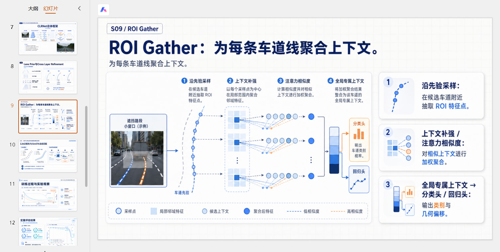

# ppt-image-first

**中文** | [English](./README.en.md)

一个 **conversation-first、image-first** 的 PPT 工作流 skill，用来把一个模糊的 PPT 需求，逐步推进成：内容基底、风格预览、定稿规划，以及后续可执行的生成流程。

`ppt-image-first` 不是那种一上来就让用户填一堆参数，或者直接套模板拼页面的 PPT skill。它更像一个分阶段推进的提案式工作流：先理解需求、补内容基底、出真实预览、允许反复推风格，最后再进入锁定与生成。

## 示例速览

### 1. 工作流总览示意图


### 2. 答辩 / 汇报类首页示例


### 3. 校园 / 红色主题类成品示例


### 4. 技术研究类正文页示例



## 示例 PPT

项目内已附一份直接用这套 workflow 做出来的介绍型演示稿，可直接下载查看：

- [下载示例 PPT（ppt-image-first-demo-deck.pptx）](./docs/demo/ppt-image-first-demo-deck.pptx)

这份文件的主题就是 `ppt-image-first` 本身，适合用来快速感受这套 skill 产出的页面风格、叙事组织和整体完成度。

---

## 这个 skill 是干什么的

它适合处理这类请求：

- “帮我做一个 PPT”
- “把这份报告整理成演示稿”
- “帮我做答辩 PPT”
- “做一个产品介绍 deck”
- “先给我几套视觉方向看看，再决定风格”
- “我现在只有主题和一些散材料，你先帮我把它整理成能做 PPT 的东西”

它的核心不是“快速出一个模板”，而是走一套完整流程：

1. 轻量 intake
2. 输出 baseline judgment
3. 进入 **需求确认**
4. 生成风格前内容基底 / `content_report.md`
5. 做风格边界对齐
6. 产出多套风格方向预览
7. 必要时继续风格 refinement
8. 进入 **风格确认**
9. 做 `风格反演确认`
10. 写规划文件
11. 进入 **生成前确认**
12. 选择生成分支
13. 进入 review & retouch loop
14. 最终导出

---

## 为什么要做这个 skill

很多 PPT 工作流会在两个方向上出问题：

- **太模板化**：看起来工整，但内容和主题贴合度不够，容易泛
- **太浅**：视觉上像 PPT，但内容没有形成真正能支撑汇报的叙事和深度

`ppt-image-first` 的目标就是同时避免这两类问题。

它的基本思路是：

- 前台对话尽量轻，不把用户拖进长问卷
- 如果材料偏薄，先补内容基底，再谈风格
- 风格确认默认依赖**真实预览图**，不是文字描述
- 最终页面视觉默认走 **image-first** 路径，不靠后期大量补 overlay 修修补补

---

## 核心特点

### 1. Conversation-first

用户被当成甲方，agent 被当成提出方向、生成方案、推进流程的设计侧。

这意味着：

- 首轮问题轻量
- 不做长表单式提问
- 用户主要对判断、方向、预览和 refinement 进行反馈
- agent 内部可以有复杂逻辑，但前台交互尽量自然

### 2. Image-first

这里的 preview 默认指 **真实生成的图像预览**，而不是：

- 文字 mockup
- ASCII 草图
- 占位壳子
- 只描述风格、不真正出图

### 3. 先补内容，再做风格

在 `需求确认` 之后，如果用户没有给出完整的报告式材料，就先生成一个 `content_report.md` 作为上游内容基底。

这样后面的：

- 首页预览
- 目录页预览
- 正文页预览
- `design_spec.md`
- `slide_blueprint.md`
- `spec_lock.md`

都不是从空主题硬编，而是有真实内容来源。

### 4. 先看预览，再确认风格

它不会让用户直接在文字里选最终风格，而是先产出：

- 首页
- 目录页
- 正文页

这三类预览，让用户看过再决定。

### 5. Review 不是可选项

第一版完整结果出来后，不默认视为结束，而是进入专门的 review-and-retouch 流程。

---

## 工作流总览

### Stage 1 — Intake and baseline judgment

只收集最必要的信息：

- 用途
- 受众
- 粗略页数 / 时长
- 手头材料
- 学校 / 公司 / 实验室 / 课题组 / 课程 / 品牌主体等真实身份锚点

然后输出一个简短 baseline judgment，并停在 **需求确认**。

### Stage 1.25 — 风格前内容研究与报告化基底

如果用户没有直接给出完整叙述内容，就先生成 `content_report.md`。

这个阶段的作用是：

- 给薄主题补出可讲的内容主线
- 把散材料整理成可展开叙事
- 让预览页不再是空壳
- 让后续规划文件有真实来源

### Stage 1.5 — 风格边界对齐

只问 3 个短问题：

- 整体偏亮 / 偏暗 / 中间态
- 常规专业路线 / 明显风格化路线
- 这次先看几套方向

### Stage 2 — 风格提案与预览

生成多套风格方向，并给出真实预览图，覆盖：

- 首页
- 目录页
- 正文页

### Stage 2.5 — 风格 refinement

如果用户对某套方向基本满意但想继续调整，就从这一套继续往下推，而不是强迫立即定稿。

### Stage 2.75 — 风格反演确认

把用户最终选中的预览图当成“证据”，反推出用户真正喜欢的是哪些稳定特征，并区分：

- 明确应延续的
- 效果好但要确认是否整套延续的
- 只在当前图里偶然成立、不建议锁死的

### Stage 3 — 规划文件

按顺序生成：

1. `design_spec.md`
2. `slide_blueprint.md`
3. `spec_lock.md`

然后进入 **生成前确认**。

### Stage 4 — 生成

先问用户是：

- 每页先出 1 张最终图
- 还是每页先出多张候选再选

如果选多候选，就先进入 candidate picker，再进入最终 review。

### Stage 5 — Review and retouch

默认用 review shell 做评审。

如果用户满意，就结束评审；不满意，就复制结构化反馈回对话继续返修。

---

## 内置工作流壳子

这个 skill 自带 3 个固定工作流界面壳子：

- `assets/preview_shell/index.html`
- `assets/candidate_picker_shell/index.html`
- `assets/review_shell/index.html`

它们分别承担：

- 风格预览比较
- 多候选选图
- 评审与返修

这些 shell 是工作流的一部分，不建议随意换成别的自制页面。

---

## 规划产物

这个 skill 主要围绕 4 个产物推进：

### `content_report.md`

风格前内容基底。用于在用户材料不完整时，先形成一个能支撑后续 PPT 的小型报告化内容稿。

### `design_spec.md`

整套 deck 的全局理由、方向、连续性约束。

### `slide_blueprint.md`

逐页定义页面意图、内容 payload、视觉策略、承载重点。

### `spec_lock.md`

执行约束文件。用于锁定什么能改、什么不能改、哪些内容不能乱编、后续生成允许采用什么策略。

---

## 它和一般 PPT skill 的差别

### 不是 template-first

不是从固定模板页出发。

### 不是 form-first

不是先让用户填一串设计参数表。

### 不是 text-mockup-first

不是靠文字描述代替真正的风格预览。

### 不是 shallow-by-default

当主题偏薄时，会先补内容基底，再出预览。

### 不是 patch-overlay-driven

不会默认把生图只当背景，再靠后期乱补标题、数字、标签、说明框去“救”页面。

---

## 目录结构

```text
ppt-image-first/
├─ SKILL.md
├─ README.md
├─ README.en.md
├─ references/
│  ├─ workflow.md
│  ├─ conversation_framework.md
│  ├─ preview-flow.md
│  └─ ...
├─ templates/
│  ├─ content_report_reference.md
│  ├─ design_spec_reference.md
│  ├─ slide_blueprint_reference.md
│  └─ spec_lock_reference.md
└─ assets/
   ├─ preview_shell/
   ├─ candidate_picker_shell/
   └─ review_shell/
```

---


## 适用场景

这套 workflow 特别适合：

- 答辩稿
- 研究汇报
- 项目汇报
- 产品介绍
- 路演 deck
- 培训课件
- 提案 deck
- 内部复盘 / 汇报演示

尤其适合这几种情况：

- 用户只有主题或零散材料
- 需要在风格前先把内容补扎实
- 需要先看真实预览再决定方向
- 最终成品必须尽量继承已确认预览的视觉逻辑

---

## 说明

- 默认比例是 `16:9`，除非用户明确要求其他比例。
- 预览页应当是 content-bearing 的，而不是空壳或占位图。
- 这套 workflow 有多个确认点，这是刻意设计，不是冗余。
- review 阶段属于主流程的一部分，不是最后临时加的补充环节。

---

## 致谢

本项目感谢 [Linux.do 社区](https://linux.do/) 对开源分享与传播的推动。
